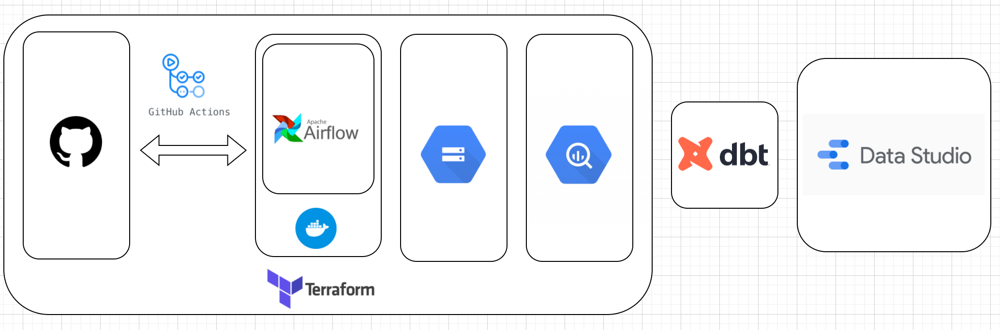
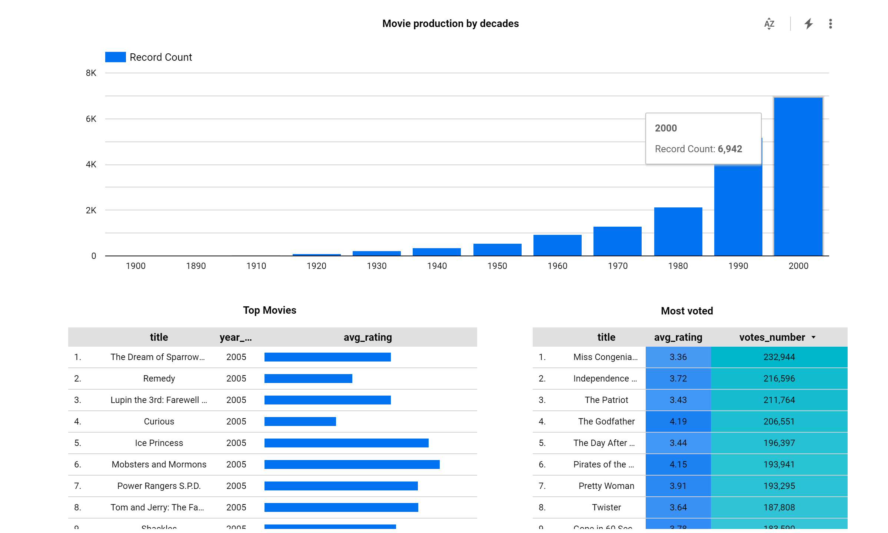

# de-project
#
**Description:**  
In this project, we will create Infrastructure for Data Pipeline, automate ETL process with Airflow, make data transformations using dbt and create a dashboard discovering Netflix movies, one of Kaggle datasets.

Project tech stack: Airflow (orchestration), dbt (T in ETL), GCP Platform (GCE, GCS, BigQuery, DataStudio), Github Actions (CI/CD), Docker, Terraform (IaC)
   

**Dashboard link:**  
https://datastudio.google.com/reporting/d5699e7f-8d3f-4d8f-b0ff-840d19083db9

<b>Whatch out, spoilers ahead !!!</b>

 
The Lord of the Rings, a series of three epic fantasy adventure films directed by Peter Jackson took over the Top Movies charts according to user ratings. 
While The Patriot, Miss congeniality and Pirates of the Caribbean are among the most voted ones.
 
    

 

Detailed instructions on how to run this project are outlined [here](https://github.com/i-bond/de-project/blob/main/howto/howto.md)

